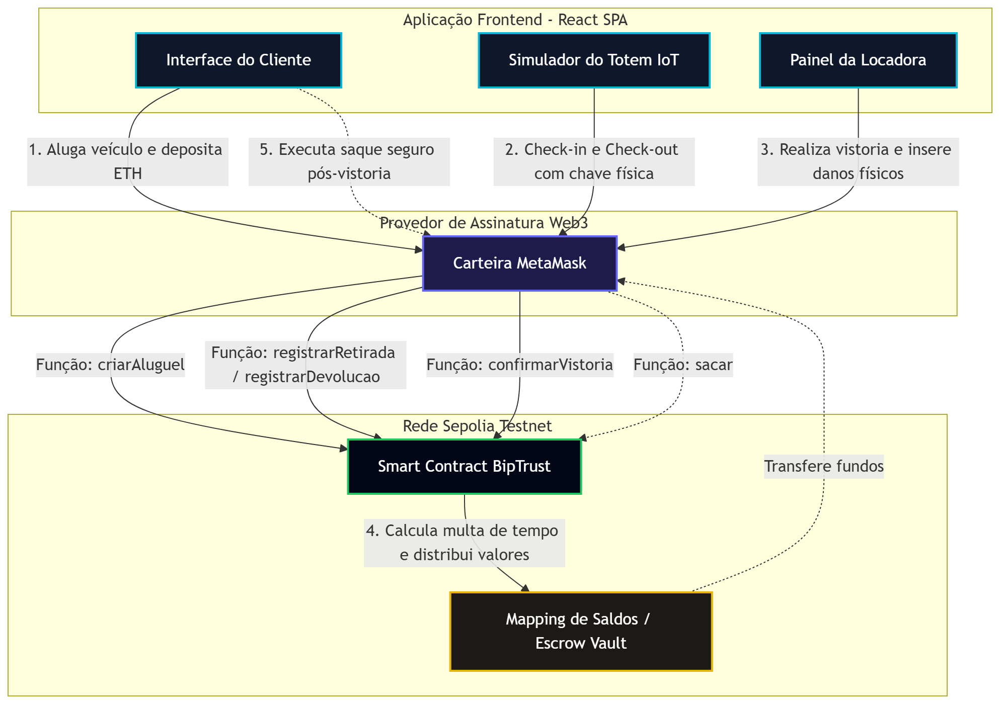
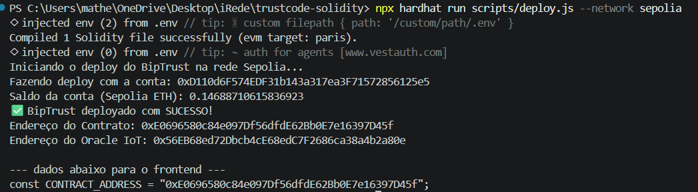
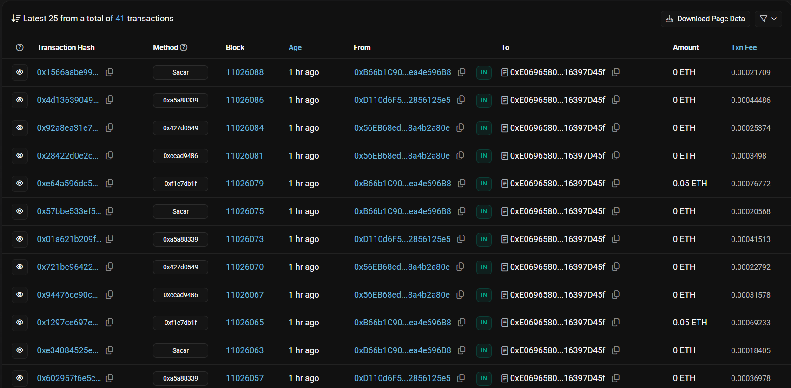

# 🚗 BipTrust | Hackweb iRede (Trilha TrustCode)
<p align="center">
  
</p>

**Endereço do Contrato (Sepolia Testnet):** `0xE0696580c84e097Df56dfdE62Bb0E7e16397D45f`
**🔗 [Link para o Contrato (Etherscan)](https://sepolia.etherscan.io/address/0xE0696580c84e097Df56dfdE62Bb0E7e16397D45f)**

## 💡 Sobre o Projeto
O **BipTrust** é um protocolo de *escrow* (caução) temporal integrado com IoT, desenhado para revolucionar o aluguel de bens de alto valor (como veículos premium e equipamentos audiovisuais). 

Hoje, o mercado exige bloqueios abusivos no cartão de crédito e depende de intermediários para calcular atrasos e devolver o dinheiro. O BipTrust resolve essa dor criando um ambiente *Zero-Trust*: o valor da caução fica protegido em um Smart Contract imutável, e o registro de tempo (check-in/check-out) é feito através da leitura física de uma tag NFC no Totem IoT da loja, transferindo a confiança do balcão humano para a blockchain.

## ⚙️ Atores necessários
A arquitetura elimina a burocracia através de 3 atores principais:
1. **O Cliente (Smart Wallet):** Bloqueia a caução (ETH) no contrato e acompanha o cronômetro regressivo da locação.
2. **O Totem IoT (Oracle/Hardware):** Um terminal na loja física que emite a transação de retirada e devolução do bem, gravando o `block.timestamp` inviolável.
3. **A Locadora (Owner):** Confere apenas se houve dano físico. A matemática das multas por atraso e a liquidação financeira de troco são executadas matematicamente pelo Smart Contract via *Pull Payments* (saque seguro).

---

## 🛠️ Tecnologias Utilizadas
* **Solidity (0.8.20):** Smart Contract core com otimização de Gas (*Struct Packing*).
* **OpenZeppelin:** Padrões de segurança (`Ownable`, `ReentrancyGuard`, `Pausable`).
* **Hardhat:** Framework de testes e deploy.
* **Ethers.js v6:** Comunicação assíncrona com a EVM e escuta de eventos on-chain.
* **React + Vite + TailwindCSS:** Frontend SPA (*Single Page Application*) focado em microinterações Web3.

---

## 📐 Fluxo do usuário

O ciclo de vida de uma locação no BipTrust é governado por **5 passos essenciais** que garantem a segurança financeira e a precisão do tempo sem intermediação humana:
1. **Criação e Depósito:** O cliente escolhe o período e deposita a caução em ETH diretamente no cofre do Smart Contract (`criarAluguel`).
2. **Check-in IoT (Retirada):** O Totem físico autoriza a retirada do bem e grava o carimbo de tempo exato de início on-chain (`registrarRetirada`).
3. **Check-out IoT (Devolução):** O cliente devolve o bem no Totem, congelando imediatamente o tempo de uso na blockchain (`registrarDevolucao`).
4. **Vistoria e Liquidação:** A locadora avalia apenas danos físicos. O contrato calcula a multa de atraso sozinho e distribui os saldos devidos (`confirmarVistoria`).
5. **Saque Seguro:** Através do padrão *Pull Payments*, os usuários retiram seus fundos de forma isolada e protegida contra reentrada (`sacar`).

<p align="center">
  
</p>

---

## 🚀 Como executar o projeto localmente

Para que a banca avaliadora consiga testar o MVP localmente, siga os passos abaixo:

### 1. Clonar e Instalar o Backend (Contratos)
```bash
# Instale as dependências da raiz (Hardhat e OpenZeppelin)
npm install

# Compile os contratos para gerar os artifacts (ABI)
npx hardhat compile
```

### 2. Configurar Variáveis de Ambiente
Crie um arquivo chamado `.env` na raiz do projeto contendo as chaves de teste (não utilize carteiras com fundos reais):
```env
PRIVATE_KEY="sua_chave_privada_da_locadora"
SEPOLIA_RPC_URL="[https://ethereum-sepolia-rpc.publicnode.com](https://ethereum-sepolia-rpc.publicnode.com)"
ORACLE_IOT_ADDRESS="sua_chave_publica_da_carteira_do_totemIoT"
```

### 3. Fazer deploy na Sepolia
Execute o script de deploy para subir o seu próprio contrato e garantir os privilégios de Owner:
```bash
npx hardhat run scripts/deploy.js --network sepolia
```
*Atenção: O terminal retornará o endereço do contrato deployado. Copie este endereço e cole no arquivo de configuração do seu frontend (`frontend/src/config.js`).*

### 4. Setup da MetaMask para Teste
A interface foi projetada como uma SPA com abas para demonstrar as diferentes visões do produto. Para testar o fluxo de ponta a ponta, alterne entre 3 contas na MetaMask (todas conectadas à rede Sepolia):
* **Conta 1 (Locadora):** Tem permissão para fazer vistorias (deve ser a owner do contrato)
* **Conta 2 (Totem IoT):** Tem permissão para "Bipar" chaves. *(Deve ser a mesma configurada no deploy do contrato).*
* **Conta 3 (Cliente):** Precisa de saldo em Sepolia ETH para depositar a caução.

### 5. Configurar e Rodar o Frontend (React)
```bash
# Entre na pasta do frontend
cd frontend

# Instale as dependências da interface
npm install

# Inicie o servidor de desenvolvimento
npm run dev
```
Acessa a aplicação em `http://localhost:5173` (ou a porta indicada pelo Vite no terminal).

---

## 📸 Evidências de funcionamento
Diversas imagens podem ser conferidas na pasta [./assets](./assets/), como:

#### Deploy do contrato na rede
<p align="center">
  
</p>

#### Interação com contrato (Etherscan)
<p align="center">
  
</p>

---

## 👥 Equipe
* **Matheus Guilherme Madureira** - *P.O & Blockchain Engineer* (matheusgmadureira@gmail.com)

Feito com ❤️ por Matheus Madureira